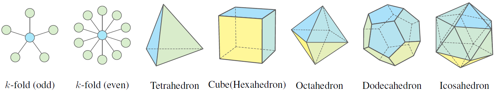

# Are High-Degree Representations Really Unnecessary in Equivarinat Graph Neural Networks? (NeurIPS 2024)

Jiacheng Cen, Anyi Li, Ning Lin, Yuxiang Ren, Zihe Wang, Wenbing Huang

[](https://github.com/GLAD-RUC/HEGNN/blob/main/LICENSE)

[**[OpenReview]**](https://openreview.net/forum?id=M0ncNVuGYN) [**[paper]**](https://openreview.net/pdf?id=M0ncNVuGYN) [**[poster]**](https://neurips.cc/virtual/2024/poster/95552)


Common symmetric graphs. Equivariant GNNs on symmetric graphs will degenerate to a zero function if the degree of their representations is fixed as 1.

## Key Requirements

```
dgl==1.1.3+cu118
e3nn==0.5.1
matplotlib==3.7.2
numpy==1.26.4
scipy==1.8.1
sympy==1.12
torch==2.1.0+cu118
torch_geometric==2.6.1
torch_scatter==2.1.2+pt21cu118
torch_sparse==0.6.18+pt21cu118
```

A more detailed Python environments is depicted in `requirements.txt`. 

## Expressivity on Symmetric Graphs

The `/expressivity` directory contains the notebooks with `rot-3D-test.ipynb` and `reg-poly-test.ipynb`, which respectively the expressivity evaulation on $k$-fold structure and five regular polyhedra. 

## Physical Dynamics Simulation

### $N$-body System Dataset

#### Data Preparation

To generate datasets containing multiple isolated particles, please use the following command.

```bash
python -u ./dataset/nbody/datagen/generate_dataset.py --num-train 5000 --seed 43 --n_isolated 100 --n_stick 0 --n_hinge 0 --n_workers 50
```

#### Run Experiments

```bash
python ./main_nbody.py --model HEGNN --ell 3 --data_directory <your_dir> --dataset_name "5_0_0"
```

### MD17 Dataset

#### Data Preparation

The MD17 dataset can be downloaded from [MD17](http://www.sgdml.org/#datasets).

#### Run Experiments

```bash
python -u ./main_md17.py --model HEGNN --ell 3 --batch_size 100 --epochs 500 --data_dir <your_dir> --delta_frame 3000 --mol "aspirin" --device --outf "md17-logs" 
```

### Perturbation Experiment

To run the experiment, please open `/expressivity/perturbation-test.ipynb`. 

## Acknowledgements

This project is based on the work from the [Geometric GNN Dojo](https://github.com/chaitjo/geometric-gnn-dojo) repository. We would like to express our gratitude to the original authors for their contributions to the field of geometric deep learning.

## Citation

If you find this work useful in your research, please consider citing:
```bibtex
@inproceedings{cen2024high,
  title={Are High-Degree Representations Really Unnecessary in Equivariant Graph Neural Networks?},
  author={Cen, Jiacheng and Li, Anyi and Lin, Ning and Ren, Yuxiang and Wang, Zihe and Huang, Wenbing},
  booktitle={The Thirty-eighth Annual Conference on Neural Information Processing Systems},
  year={2024},
  url={https://openreview.net/forum?id=M0ncNVuGYN}
}
```